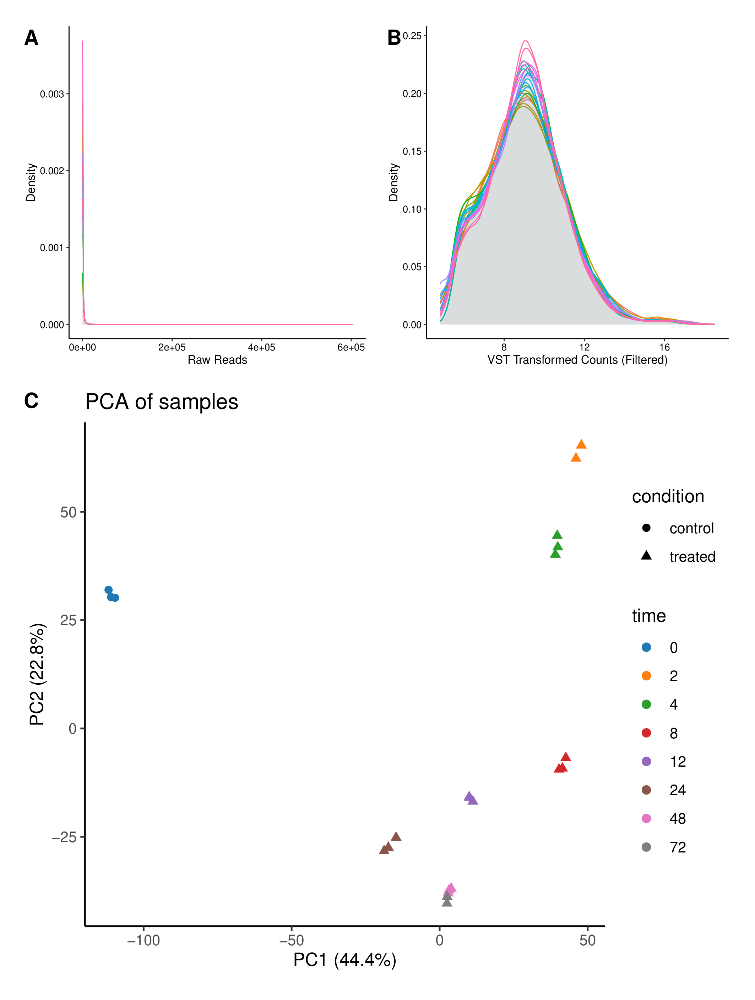
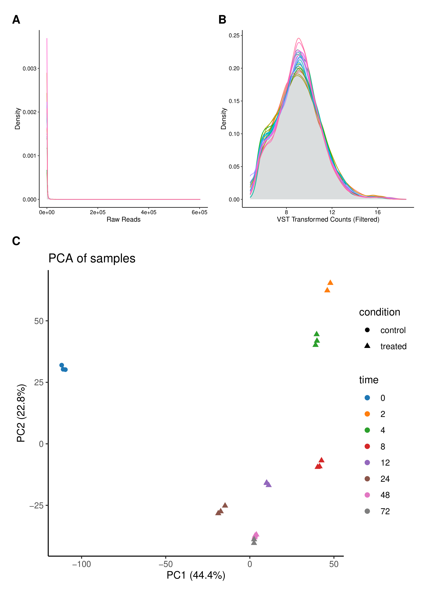
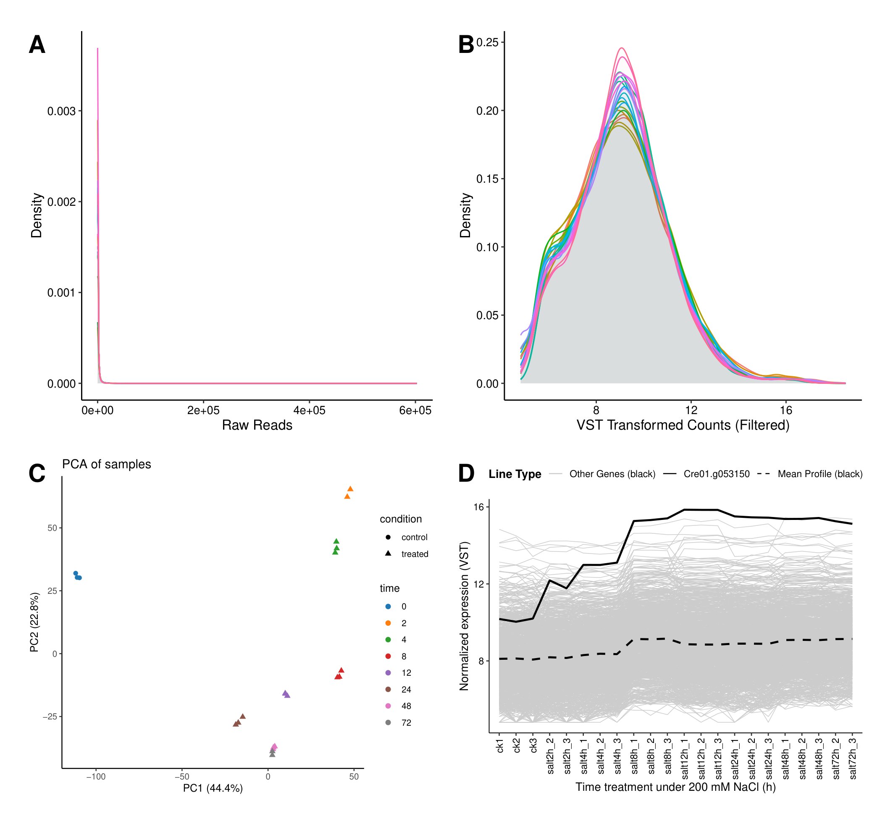
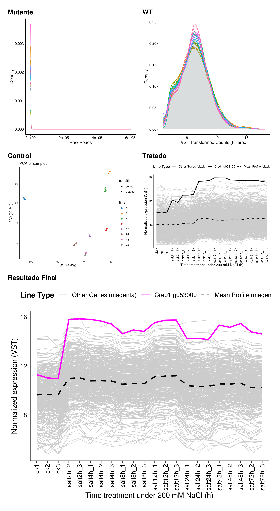
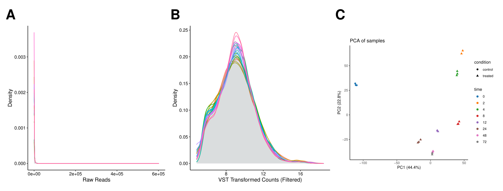

# Scientific Panel Generator

Este script combina múltiples figuras PDF en un solo panel, respetando las proporciones originales y optimizando el espacio automáticamente.

## Características Principales

- **Smart Sizing**: Calcula automáticamente el alto de las filas para que las figuras llenen el ancho de la página sin deformarse.
- **Auto-Height**: Si no especificas la altura de la página, el script la calcula para un ajuste perfecto.
- **Nomenclatura Intuitiva**: Soporta layouts como `2,1`, `3,2`, o el clásico `AB-C`.
- **Multi-formato**: Exporta directamente a **PDF, PNG, TIFF, SVG o JPG**.

## Instalación

Para configurar el ambiente de trabajo y las dependencias utilizando `uv`:

```bash
# Crear el ambiente virtual
uv venv

# Activar el ambiente (Windows)
.venv\Scripts\activate

# Instalar dependencias
uv pip install -r requirements.txt
```

## Uso Básico

Para crear un panel con 2 figuras arriba y una abajo (rellenando el ancho):

```bash
python scientific_panel_generator.py --layout 2,1 --input FigA.pdf FigB.pdf FigC.pdf --output panel.pdf
```

## Argumentos

| Argumento | Descripción | Default |
|-----------|-------------|---------|
| `--layout` | Estructura del panel. Ej: `2,1` (Fila 1: 2 imgs, Fila 2: 1 img) | **Requerido** |
| `--input` | Lista de archivos PDF de entrada. | **Requerido** |
| `--output` | Archivo de salida (`.pdf`, `.png`, `.tiff`, `.svg`). | **Requerido** |
| `--page-width` | Ancho de la página en mm. | `180` |
| `--page-height` | Alto de la página en mm (se autocalcula si se omite). | `None` |
| `--margin` | Margen exterior en mm. | `5` |
| `--spacing` | Espacio entre figuras en mm. | `3` |
| `--label-size` | Tamaño de fuente de las etiquetas (A, B, C...). | `14` |
| `--labels` | Etiquetas personalizadas. Ej: `--labels "Fig1" "Fig2"`. | `None` |
| `--dpi` | Resolución para exportación a imagen (PNG/TIFF). | `300` |

---

## Ejemplos de Uso

### 1. Ajuste Perfecto (Auto-Height)

El script calculará el alto ideal (aprox 266mm) para que la imagen de abajo ocupe todo el ancho de los dos paneles superiores.

```bash
python scientific_panel_generator.py --layout 2,1 --input FigA.pdf FigB.pdf FigC.pdf --output ejemplo_1_auto_height.pdf --page-width 180
```

<p align="center">
  
</p>

### 2. Exportar a PNG para Publicación (300 DPI)

```bash
python scientific_panel_generator.py --layout 2,1 --input FigA.pdf FigB.pdf FigC.pdf --output ejemplo_2_png_300dpi.png --dpi 300
```

<p align="center">
  
</p>

### 3. Layout de Rejilla (2x2)

```bash
python scientific_panel_generator.py --layout 2x2 --input FigA.pdf FigB.pdf FigC.pdf FigD.pdf --output ejemplo_3_grid_2x2.pdf
```

<p align="center">
  
</p>

### 4. Layout Complejo con Etiquetas Personalizadas

```bash
python scientific_panel_generator.py --layout 2,2,1 --input FigA.pdf FigB.pdf FigC.pdf FigD.pdf FigE.pdf --output ejemplo_4_complejo.pdf --labels "Mutante" "WT" "Control" "Tratado" "Resultado Final" --label-size 12
```

<p align="center">
  
</p>

### 5. Configuración de Márgenes y Espaciado

```bash
python scientific_panel_generator.py --layout 3 --input FigA.pdf FigB.pdf FigC.pdf --output ejemplo_5_wide_panel.pdf --margin 2 --spacing 1
```

<p align="center">
  
</p>

---

## Organización de Layouts

El script es extremadamente flexible. Puedes definir **cualquier combinación** de filas y columnas:

- **Horizontales**:
  - `3` : Una sola fila con 3 figuras.
  - `2,1` : Fila de 2, luego fila de 1 (Panel C se expande).
- **Verticales**:
  - `1,1,1` : Una columna con 3 figuras (una por fila).
- **Grillas (Rejilla)**:
  - `2x2` : 2 columnas y 2 filas.
  - `3x1` : 3 columnas y 1 fila (Horizontal).
  - `1x3` : 1 columna y 3 filas (Vertical).

> [!TIP]
> La nomenclatura `NxM` usa el formato **Columnas x Filas**. Si quieres un panel vertical de 3 figuras, puedes usar `--layout 1,1,1` o `--layout 1x3`.

Cualquier combinación de números separados por comas o guiones funciona, permitiéndote crear paneles de 2, 3, 4, 5 o los que necesites.

---

*Desarrollado para optimización de paneles científicos con precisión de proporciones.*
